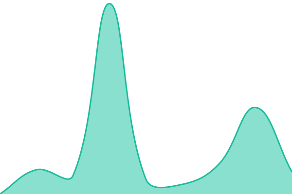
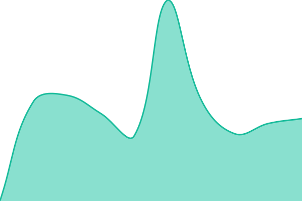
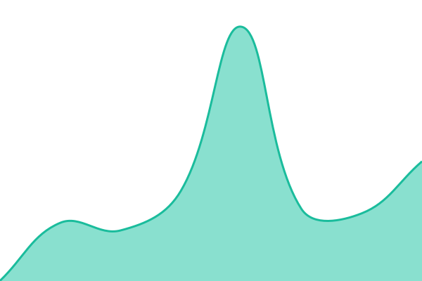
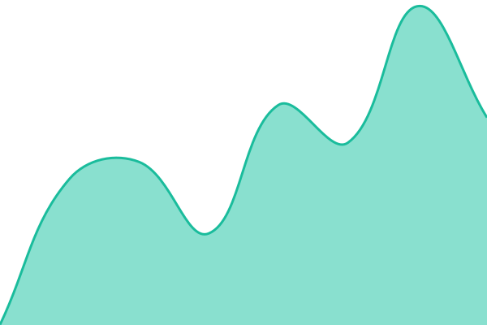
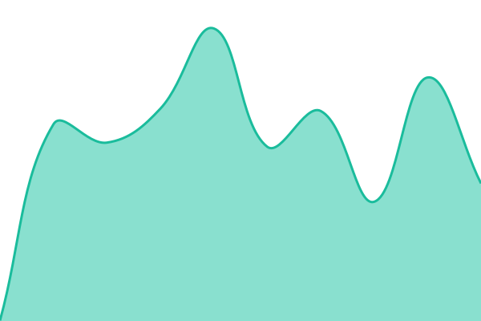
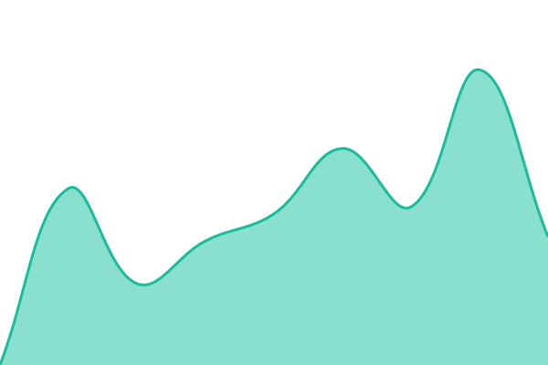
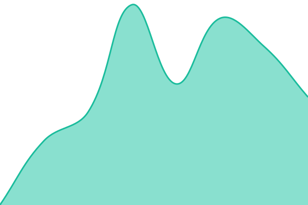
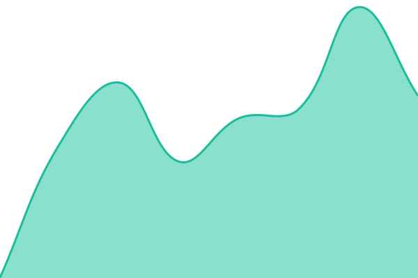
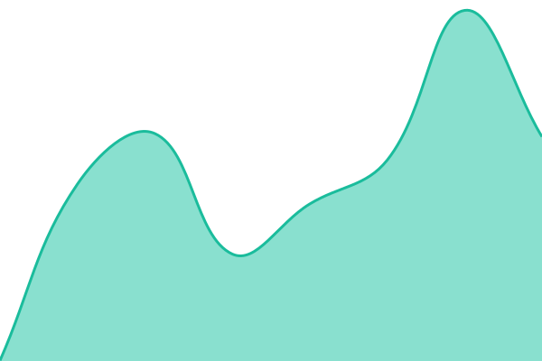

# [📈 Live Status](https://JefCurtis.github.io/upptime): <!--live status--> **🟧 Partial outage**

This repository contains the open-source uptime monitor and status page for [Jef Curtis](https://JefCurtis.github.io/upptime), powered by [Upptime](https://github.com/upptime/upptime).

With [Upptime](https://upptime.js.org), you can get your own unlimited and free uptime monitor and status page, powered entirely by a GitHub repository. We use [Issues](https://github.com/JefCurtis/upptime/issues) as incident reports, [Actions](https://github.com/JefCurtis/upptime/actions) as uptime monitors, and [Pages](https://JefCurtis.github.io/upptime) for the status page.

<!--start: status pages-->
<!-- This summary is generated by Upptime (https://github.com/upptime/upptime) -->
<!-- Do not edit this manually, your changes will be overwritten -->
<!-- prettier-ignore -->
| URL | Status | History | Response Time | Uptime |
| --- | ------ | ------- | ------------- | ------ |
|  [Audiobookshelf](https://abs.jefcurtis.com) | 🟩 Up | [audiobookshelf.yml](https://github.com/JefCurtis/upptime/commits/HEAD/history/audiobookshelf.yml) | 

 497ms
     
 | 

<a href="https://status.jefcurtis.com/history/audiobookshelf">100.00%</a>
    

|  [Backups](https://backups.jefcurtis.com) | 🟩 Up | [backups.yml](https://github.com/JefCurtis/upptime/commits/HEAD/history/backups.yml) | 

 396ms
     
 | 

<a href="https://status.jefcurtis.com/history/backups">100.00%</a>
    

|  [Bazarr](https://bazarr.jefcurtis.com) | 🟥 Down | [bazarr.yml](https://github.com/JefCurtis/upptime/commits/HEAD/history/bazarr.yml) | 

 248ms
     
 | 

<a href="https://status.jefcurtis.com/history/bazarr">0.00%</a>
    

|  [BookLore](https://booklore.jefcurtis.com) | 🟩 Up | [book-lore.yml](https://github.com/JefCurtis/upptime/commits/HEAD/history/book-lore.yml) | 

 395ms
     
 | 

<a href="https://status.jefcurtis.com/history/book-lore">98.56%</a>
    

|  [Komga](https://comics.jefcurtis.com) | 🟩 Up | [komga.yml](https://github.com/JefCurtis/upptime/commits/HEAD/history/komga.yml) | 

 767ms
     
 | 

<a href="https://status.jefcurtis.com/history/komga">99.50%</a>
    

|  [Dockge](https://dockge.jefcurtis.com) | 🟩 Up | [dockge.yml](https://github.com/JefCurtis/upptime/commits/HEAD/history/dockge.yml) | 

 330ms
     
 | 

<a href="https://status.jefcurtis.com/history/dockge">100.00%</a>
    

|  [Files](https://files.jefcurtis.com) | 🟩 Up | [files.yml](https://github.com/JefCurtis/upptime/commits/HEAD/history/files.yml) | 

 361ms
     
 | 

<a href="https://status.jefcurtis.com/history/files">100.00%</a>
    

|  [FreshRSS](https://freshrss.jefcurtis.com) | 🟩 Up | [fresh-rss.yml](https://github.com/JefCurtis/upptime/commits/HEAD/history/fresh-rss.yml) | 

 649ms
     
 | 

<a href="https://status.jefcurtis.com/history/fresh-rss">100.00%</a>
    

|  [Games](https://games.jefcurtis.com) | 🟩 Up | [games.yml](https://github.com/JefCurtis/upptime/commits/HEAD/history/games.yml) | 

 280ms
     
 | 

<a href="https://status.jefcurtis.com/history/games">100.00%</a>
    

|  [Kapowarr](https://kapowarr.jefcurtis.com) | 🟩 Up | [kapowarr.yml](https://github.com/JefCurtis/upptime/commits/HEAD/history/kapowarr.yml) | 

 318ms
     
 | 

<a href="https://status.jefcurtis.com/history/kapowarr">100.00%</a>
    

|  [Komf](https://komf.jefcurtis.com) | 🟩 Up | [komf.yml](https://github.com/JefCurtis/upptime/commits/HEAD/history/komf.yml) | 

 462ms
     
 | 

<a href="https://status.jefcurtis.com/history/komf">100.00%</a>
    

|  [Lidarr](https://lidarr.jefcurtis.com) | 🟩 Up | [lidarr.yml](https://github.com/JefCurtis/upptime/commits/HEAD/history/lidarr.yml) | 

 550ms
     
 | 

<a href="https://status.jefcurtis.com/history/lidarr">100.00%</a>
    

|  [Maintainerr](https://maintainerr.jefcurtis.com) | 🟩 Up | [maintainerr.yml](https://github.com/JefCurtis/upptime/commits/HEAD/history/maintainerr.yml) | 

 414ms
     
 | 

<a href="https://status.jefcurtis.com/history/maintainerr">100.00%</a>
    

|  [n8n](https://n8n.jefcurtis.com) | 🟩 Up | [n8n.yml](https://github.com/JefCurtis/upptime/commits/HEAD/history/n8n.yml) | 

 440ms
     
 | 

<a href="https://status.jefcurtis.com/history/n8n">100.00%</a>
    

|  [nginx-proxy-manager](https://npm.jefcurtis.com) | 🟩 Up | [nginx-proxy-manager.yml](https://github.com/JefCurtis/upptime/commits/HEAD/history/nginx-proxy-manager.yml) | 

 246ms
     
 | 

<a href="https://status.jefcurtis.com/history/nginx-proxy-manager">100.00%</a>
    

|  [Overseerr](https://overseerr.jefcurtis.com) | 🟩 Up | [overseerr.yml](https://github.com/JefCurtis/upptime/commits/HEAD/history/overseerr.yml) | 

 1105ms
     
 | 

<a href="https://status.jefcurtis.com/history/overseerr">100.00%</a>
    

|  [Paperless](https://paperless.jefcurtis.com) | 🟩 Up | [paperless.yml](https://github.com/JefCurtis/upptime/commits/HEAD/history/paperless.yml) | 

 540ms
     
 | 

<a href="https://status.jefcurtis.com/history/paperless">100.00%</a>
    

|  [Paperless-AI](https://paperless-ai.jefcurtis.com) | 🟩 Up | [paperless-ai.yml](https://github.com/JefCurtis/upptime/commits/HEAD/history/paperless-ai.yml) | 

 324ms
     
 | 

<a href="https://status.jefcurtis.com/history/paperless-ai">100.00%</a>
    

|  [Pi-hole](https://pihole.jefcurtis.com/admin) | 🟩 Up | [pi-hole.yml](https://github.com/JefCurtis/upptime/commits/HEAD/history/pi-hole.yml) | 

 649ms
     
 | 

<a href="https://status.jefcurtis.com/history/pi-hole">100.00%</a>
    

|  [Prowlarr](https://prowlarr.jefcurtis.com) | 🟩 Up | [prowlarr.yml](https://github.com/JefCurtis/upptime/commits/HEAD/history/prowlarr.yml) | 

 546ms
     
 | 

<a href="https://status.jefcurtis.com/history/prowlarr">100.00%</a>
    

|  [Radarr](https://radarr.jefcurtis.com) | 🟩 Up | [radarr.yml](https://github.com/JefCurtis/upptime/commits/HEAD/history/radarr.yml) | 

 532ms
     
 | 

<a href="https://status.jefcurtis.com/history/radarr">100.00%</a>
    

|  [RomM](https://romm.jefcurtis.com) | 🟩 Up | [rom-m.yml](https://github.com/JefCurtis/upptime/commits/HEAD/history/rom-m.yml) | 

 231ms
     
 | 

<a href="https://status.jefcurtis.com/history/rom-m">100.00%</a>
    

|  [SABnzbd](https://sabnzbd.jefcurtis.com) | 🟩 Up | [sa-bnzbd.yml](https://github.com/JefCurtis/upptime/commits/HEAD/history/sa-bnzbd.yml) | 

 460ms
     
 | 

<a href="https://status.jefcurtis.com/history/sa-bnzbd">100.00%</a>
    

|  [Sonarr](https://sonarr.jefcurtis.com) | 🟩 Up | [sonarr.yml](https://github.com/JefCurtis/upptime/commits/HEAD/history/sonarr.yml) | 

 500ms
     
 | 

<a href="https://status.jefcurtis.com/history/sonarr">100.00%</a>
    

<!--end: status pages-->

[**Visit our status website →**](https://JefCurtis.github.io/upptime)

## 📄 License

- Powered by: [Upptime](https://github.com/upptime/upptime)
- Code: [MIT](./LICENSE) © [Anand Chowdhary](https://anandchowdhary.com)
- Data in the `./history` directory: [Open Database License](https://opendatacommons.org/licenses/odbl/1-0/)
